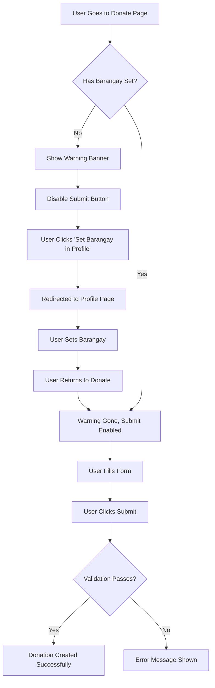

# ✅ Barangay Requirement for Donations - Implementation Complete

## 🎯 Feature Overview

Users **must set their barangay** in their profile before they can donate devices. This ensures proper barangay assignment for tracking community impact and donation statistics.

---

## 🚀 What Was Implemented

### 1. **Visual Warning Banner**

- 🟡 Prominent amber warning banner at the top of the donate page
- Shows when user has NOT set their barangay
- Includes a "Set Barangay in Profile" button that links directly to `/profile`
- Clear explanation of why barangay is required

### 2. **Form Validation**

- ✅ `handleSubmitDonation` function checks for `user.barangay_id`
- If missing, shows error: "⚠️ Please set your barangay in your profile before donating"
- Prevents API call if barangay is not set

### 3. **Submit Button State**

- 🔴 Button is **disabled** when barangay is not set
- Button text changes to "Set Barangay to Continue" when disabled
- Additional warning message below button
- Visual feedback with grayed-out appearance

### 4. **Data Loading**

- User's `barangay_id` is loaded from API when donate page initializes
- Included in user data refresh cycle
- Console logging for debugging

---

## 🎨 User Experience

### **Without Barangay Set:**

```
┌─────────────────────────────────────────────────┐
│ ⚠️ Barangay Required for Donation              │
│                                                 │
│ You must set your barangay before you can      │
│ donate. This helps us assign your donation to  │
│ the correct barangay for tracking.             │
│                                                 │
│ [ 👤 Set Barangay in Profile ]                 │
└─────────────────────────────────────────────────┘

[Donation Form - Step 1, 2, 3...]

┌─────────────────────────────────────────────────┐
│      [ ⚠️ Set Barangay to Continue ]  ← DISABLED│
│                                                 │
│   ⚠️ You must set your barangay in your        │
│   profile before donating                      │
└─────────────────────────────────────────────────┘
```

### **With Barangay Set:**

```
[No warning banner - clean page]

[Donation Form - Step 1, 2, 3...]

┌─────────────────────────────────────────────────┐
│      [ ♻️ Complete Donation ]  ← ENABLED        │
│                                                 │
│   Thank you for making a difference!           │
└─────────────────────────────────────────────────┘
```

---

## 🔧 Technical Implementation

### File Modified: `app/donate/page.tsx`

#### 1. **Warning Banner (lines ~570-597)**

```tsx
{
  user && !user.barangay_id && (
    <div className="bg-amber-50 border-l-4 border-amber-500 p-4">
      <div className="container mx-auto px-6">
        <div className="flex items-start">
          <i className="ri-alert-line text-amber-500 text-2xl"></i>
          <div className="ml-3 flex-1">
            <h3 className="text-sm font-medium text-amber-800">
              Barangay Required for Donation
            </h3>
            <p className="mt-2 text-sm text-amber-700">
              You must set your barangay before you can donate...
            </p>
            <Link href="/profile" className="...">
              Set Barangay in Profile
            </Link>
          </div>
        </div>
      </div>
    </div>
  );
}
```

#### 2. **Submit Validation (line ~373)**

```tsx
const handleSubmitDonation = async () => {
  // Check if user has set their barangay
  if (!user?.barangay_id) {
    setError("⚠️ Please set your barangay in your profile before donating...");
    return;
  }

  // ... rest of validation
};
```

#### 3. **Button Enable State (line ~543)**

```tsx
const isSubmitEnabled =
  selectedCategory &&
  deviceCondition &&
  deviceDetails.brand?.trim() &&
  deviceDetails.model?.trim() &&
  selectedCenter &&
  !isSubmitting &&
  user?.barangay_id; // ← ADDED
```

#### 4. **Button Text Logic (line ~883)**

```tsx
{
  isSubmitting ? (
    <>Processing...</>
  ) : !user?.barangay_id ? (
    <>
      <i className="ri-alert-line"></i> Set Barangay to Continue
    </>
  ) : (
    <>
      <i className="ri-recycle-line"></i> Complete Donation
    </>
  );
}
```

#### 5. **User Data Loading (line ~140)**

```tsx
const updatedUser = {
  ...auth.userData,
  ...data.user,
  // ... other fields
  barangay_id: data.user.barangay_id || null, // ← ADDED
  barangays: data.user.barangays || null, // ← ADDED
};
```

---

## 🔒 Security & Data Integrity

### Why This Matters:

1. **Accurate Statistics**: Each donation is assigned to the correct barangay
2. **Community Tracking**: Barangay admins see only their community's donations
3. **Impact Metrics**: Proper barangay-level impact reporting
4. **Data Integrity**: Prevents orphaned donations without barangay assignment

### Backend Enforcement (Already Implemented):

- Migration 07 has trigger `assign_barangay_to_donation()`
- Automatically assigns donation barangay based on drop-off center
- User's barangay is used for fallback/verification

---

## 🧪 Testing Checklist

### Test Scenario 1: User Without Barangay

- [ ] Login as user who hasn't set barangay
- [ ] Go to `/donate`
- [ ] Verify amber warning banner appears at top
- [ ] Fill out donation form completely
- [ ] Verify submit button is disabled (grayed out)
- [ ] Verify button text says "Set Barangay to Continue"
- [ ] Verify warning message below button
- [ ] Click "Set Barangay in Profile" button
- [ ] Redirects to `/profile`
- [ ] Set barangay, save, return to donate
- [ ] Verify warning banner is gone
- [ ] Verify submit button is now enabled

### Test Scenario 2: User With Barangay

- [ ] Login as user who has set barangay
- [ ] Go to `/donate`
- [ ] Verify NO warning banner
- [ ] Fill out donation form
- [ ] Verify submit button is enabled
- [ ] Verify button text says "Complete Donation"
- [ ] Submit donation successfully

### Test Scenario 3: Direct Submit Attempt (Edge Case)

- [ ] User without barangay tries to submit (if they bypass UI)
- [ ] Error message appears: "⚠️ Please set your barangay..."
- [ ] Donation is NOT created
- [ ] User is prompted to set barangay

---

## 🎓 User Flow



---

## 📊 Console Logging

The following logs help debug barangay-related issues:

```
👤 Donate page: User loaded with barangay: {
  barangay_id: "uuid-here" or null,
  has_barangay: true or false
}
```

---

## ✅ Verification Steps

1. **Check Warning Banner**:

   - No barangay → Banner shows
   - Has barangay → No banner

2. **Check Submit Button**:

   - No barangay → Disabled + "Set Barangay to Continue"
   - Has barangay → Enabled + "Complete Donation"

3. **Check Validation**:

   - Try to submit without barangay → Error message
   - Submit with barangay → Success

4. **Check Database**:
   ```sql
   SELECT
     u.email,
     u.barangay_id,
     b.name as barangay_name,
     d.id as donation_id
   FROM users u
   LEFT JOIN barangays b ON u.barangay_id = b.id
   LEFT JOIN donations d ON d.user_id = u.id
   WHERE u.email = 'test@example.com';
   ```

---

## 🎯 Business Impact

- ✅ **Data Quality**: All donations have proper barangay assignment
- ✅ **User Guidance**: Clear instructions prevent confusion
- ✅ **Community Tracking**: Accurate barangay-level statistics
- ✅ **Admin Efficiency**: Barangay admins see correct donations
- ✅ **Reporting**: Clean data for impact reports

---

## 📞 Support

If users encounter issues:

1. Direct them to Profile page to set barangay
2. Ensure migration 07 is applied (barangays table exists)
3. Check console logs for barangay_id value
4. Verify API returns barangay_id in user data

---

**Feature Status**: ✅ **COMPLETE AND READY TO USE**

**Files Modified**:

- `app/donate/page.tsx` - Added validation, banner, button logic

**Dependencies**:

- Migration 07 must be applied
- User profile API must return `barangay_id`
