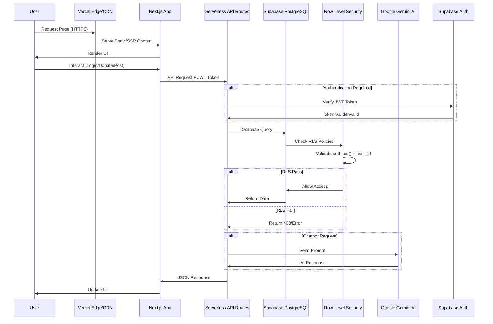
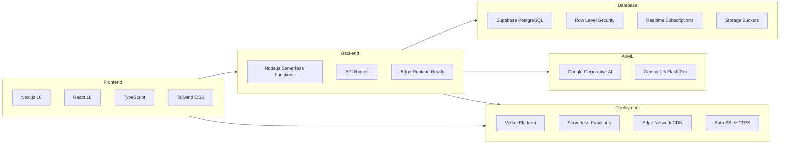
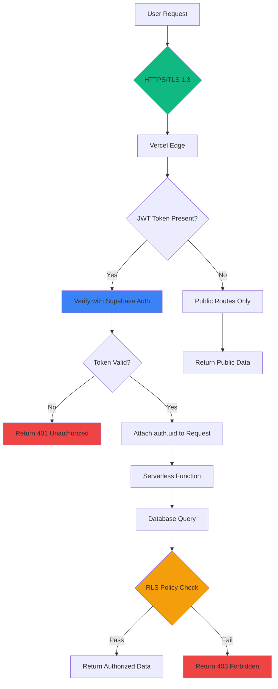
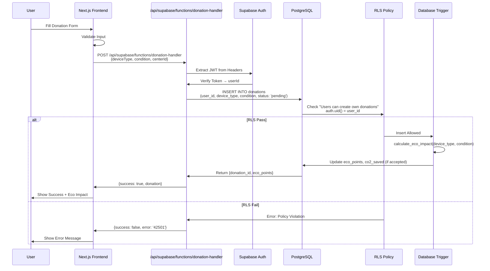
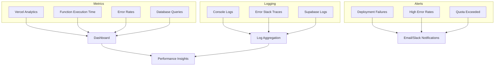

# 🏗️ EcoKonek Deployment Architecture

## Architecture Overview

EcoKonek leverages a **Serverless Architecture** with managed cloud services, eliminating the need for manual server provisioning and enabling automatic scaling based on user demand.

---

## Architecture Diagram

```mermaid
graph TB
    subgraph "Client Layer"
        A[Web Browser]
        B[Mobile Browser]
    end

    subgraph "CDN & Edge Network"
        C[Vercel Edge Network]
        D[Global CDN]
    end

    subgraph "Application Layer - Vercel Serverless"
        E[Next.js 16 Frontend]
        F[Static Assets]

        subgraph "API Routes - Node.js Serverless Functions"
            G[/api/chatbot]
            H[/api/supabase/functions/auth-handler]
            I[/api/supabase/functions/community-handler]
            J[/api/supabase/functions/donation-handler]
            K[/api/supabase/functions/user-profile]
        end
    end

    subgraph "Database Layer - Supabase"
        L[(PostgreSQL Database)]
        M[Row Level Security RLS]
        N[Realtime Subscriptions]
        O[Storage Buckets]
        P[Edge Functions]
    end

    subgraph "External Services"
        Q[Google Generative AI - Gemini]
        R[Supabase Auth]
        S[Email Service]
    end

    subgraph "Authentication & Authorization"
        T[JWT Tokens]
        U[Session Management]
        V[OAuth Providers]
    end

    A --> C
    B --> C
    C --> D
    D --> E
    D --> F

    E --> G
    E --> H
    E --> I
    E --> J
    E --> K

    G --> Q
    H --> R
    H --> L
    I --> L
    I --> M
    J --> L
    J --> M
    K --> L
    K --> M

    L --> N
    L --> O

    R --> T
    R --> U
    R --> V
    R --> S

    T --> M
    U --> M

    style A fill:#e1f5ff
    style B fill:#e1f5ff
    style C fill:#00d4aa
    style D fill:#00d4aa
    style E fill:#0070f3
    style F fill:#0070f3
    style G fill:#7c3aed
    style H fill:#7c3aed
    style I fill:#7c3aed
    style J fill:#7c3aed
    style K fill:#7c3aed
    style L fill:#3ecf8e
    style M fill:#f59e0b
    style Q fill:#4285f4
    style R fill:#3ecf8e
```

---

## Detailed Component Flow



---

## Serverless Deployment Model

### ✅ Benefits of Serverless Architecture

1. **Auto-Scaling**

   - Vercel automatically scales serverless functions based on traffic
   - No manual server provisioning required
   - Pay only for actual usage (execution time)

2. **Global Edge Distribution**

   - Static assets cached at 300+ edge locations worldwide
   - Low latency for users in Philippines and globally
   - Automatic HTTPS/SSL certificates

3. **Zero DevOps Overhead**

   - No server maintenance, patching, or monitoring
   - Managed infrastructure by Vercel and Supabase
   - Automatic deployments from Git push

4. **Cost Efficiency**

   - Free tier supports substantial traffic
   - Vercel: Generous free tier for personal/small projects
   - Supabase: 500MB database, 2GB bandwidth free

5. **Database as a Service**
   - Supabase manages PostgreSQL hosting, backups, scaling
   - Built-in connection pooling and performance optimization
   - Automatic security updates

---

## Technology Stack



---

## Infrastructure Components

### 1. **Vercel Platform (Application Hosting)**

- **Purpose**: Host Next.js application and API routes
- **Runtime**: Node.js 18/20 serverless functions
- **Scaling**: Automatic based on request volume
- **Regions**: Global edge network
- **Cost**: Free tier → Pro ($20/month) for production

### 2. **Supabase (Backend as a Service)**

- **Database**: PostgreSQL 15 with PostGIS
- **Authentication**: JWT-based auth with magic links, OAuth
- **Storage**: File uploads (profile images, device photos)
- **Realtime**: WebSocket subscriptions for live updates
- **Cost**: Free tier → Pro ($25/month) at scale

### 3. **Google Generative AI (AI Assistant)**

- **API**: REST API with multiple model fallbacks
- **Models**: Gemini 1.5 Flash, Pro (v1/v1beta)
- **Usage**: Chatbot responses, eco-tips
- **Cost**: Free tier (60 requests/minute) → Pay-as-you-go

---

## Security Architecture



### Security Layers

1. **Transport Security**

   - Automatic HTTPS/SSL via Vercel
   - TLS 1.3 encryption for all traffic
   - HSTS headers enforced

2. **Authentication**

   - Supabase Auth with JWT tokens
   - Secure session management in localStorage
   - Magic link & OAuth support

3. **Authorization**

   - Row Level Security (RLS) policies on all tables
   - `auth.uid() = user_id` enforcement
   - Authenticated Supabase clients with JWT headers

4. **API Security**
   - CORS configured for production domain
   - Rate limiting on serverless functions
   - Environment variables secured in Vercel

---

## Data Flow: Donation Submission Example



---

## Deployment Pipeline

```mermaid
flowchart LR
    A[Git Push to main] --> B[GitHub Webhook]
    B --> C[Vercel Build Trigger]
    C --> D[Install Dependencies<br/>npm install]
    D --> E[Type Check<br/>tsc --noEmit]
    E --> F[Build Next.js<br/>next build]
    F --> G[Deploy to Edge Network]
    G --> H[Run Health Checks]
    H --> I{Tests Pass?}

    I -->|Yes| J[Promote to Production]
    I -->|No| K[Rollback to Previous]

    J --> L[Update DNS]
    L --> M[Issue SSL Certificate]
    M --> N[Live on Custom Domain]

    style A fill:#4ade80
    style J fill:#10b981
    style K fill:#ef4444
    style N fill:#3b82f6
```



### CI/CD Process

1. **Automatic Deployments**

   - Every push to `main` triggers production deployment
   - Pull requests get preview URLs
   - Instant rollback with version history

2. **Build Optimization**

   - Static generation for public pages
   - Server-side rendering for dynamic content
   - API routes bundled as serverless functions

3. **Environment Management**
   - Development: `http://localhost:3000`
   - Preview: `*.vercel.app` (PR branches)
   - Production: `yourdomain.com` (main branch)

---

## Monitoring & Observability



---

## Scalability Considerations

### Horizontal Scaling

- **Serverless Functions**: Auto-scale to 1000s of concurrent executions
- **Database**: Supabase connection pooling (up to 500 connections)
- **CDN**: Unlimited edge cache capacity

### Vertical Scaling

- **Database**: Upgrade Supabase plan (RAM, CPU, storage)
- **Functions**: Increase memory allocation (1024MB max on Vercel Pro)
- **Rate Limits**: Configure per-route throttling

### Performance Optimizations

- **Caching**: Static assets cached at edge (immutable)
- **Database Indexing**: Indexes on user_id, created_at, status
- **Query Optimization**: Use `select()` to fetch only needed columns
- **Image Optimization**: WebP conversion, lazy loading

---

## Cost Estimation (Monthly)

| Service       | Free Tier                            | Expected Usage           | Estimated Cost        |
| ------------- | ------------------------------------ | ------------------------ | --------------------- |
| **Vercel**    | 100GB bandwidth, unlimited functions | ~5K users/month          | $0 (Free) → $20 (Pro) |
| **Supabase**  | 500MB DB, 2GB bandwidth, 50K MAU     | ~1K users                | $0 (Free) → $25 (Pro) |
| **Google AI** | 60 req/min free                      | ~500 chatbot queries/day | $0 (Free tier)        |
| **Domain**    | N/A                                  | 1 domain                 | $12/year (Namecheap)  |
| **Total**     | -                                    | -                        | **$0-45/month**       |

---

## Environment Variables

Required for production deployment:

```bash
# Supabase Configuration
NEXT_PUBLIC_SUPABASE_URL=https://yxoxxrbukjyioyfveaml.supabase.co
NEXT_PUBLIC_SUPABASE_ANON_KEY=eyJhbGciOiJIUzI1NiIsInR5cCI6IkpXVCJ9...

# Google AI Configuration
GOOGLE_AI_API_KEY=AIzaSy...

# Optional: Supabase Service Role (backend only - not exposed to client)
# SUPABASE_SERVICE_ROLE_KEY=eyJhbGciOiJIUzI1NiIsInR5cCI6IkpXVCJ9...
```

**Security Notes:**

- `NEXT_PUBLIC_*` variables are exposed to the browser (safe for anon keys)
- Service role keys should NEVER be prefixed with `NEXT_PUBLIC_`
- Store in Vercel environment variables, not in code

---

## Post-Deployment Checklist

- [ ] Vercel deployment successful
- [ ] Custom domain configured with SSL
- [ ] Environment variables set in production
- [ ] Supabase Site URL updated to custom domain
- [ ] Supabase Redirect URLs include production domain
- [ ] All API routes return 200 OK (health check)
- [ ] RLS policies tested with production auth
- [ ] Chatbot responds successfully
- [ ] Donation flow end-to-end test
- [ ] Community post creation works
- [ ] Database migrations applied
- [ ] Error monitoring enabled
- [ ] Performance benchmarks met (<2s page load)

---

## Disaster Recovery

### Backup Strategy

- **Database**: Supabase automatic daily backups (7-day retention on free tier)
- **Code**: Git version control on GitHub
- **Deployments**: Vercel maintains 100+ deployment snapshots

### Recovery Procedures

1. **Database Restore**: Supabase Dashboard → Database → Backups → Restore
2. **Code Rollback**: Vercel Dashboard → Deployments → Redeploy previous version
3. **Domain Issues**: Vercel automatically renews SSL; check DNS propagation

### High Availability

- **Uptime SLA**: Vercel 99.99% uptime guarantee (Enterprise)
- **Multi-Region**: Edge network ensures redundancy
- **Failover**: Automatic rerouting to healthy edge nodes

---

## Future Enhancements

1. **Performance**

   - Implement Redis caching for leaderboard queries
   - Add service worker for offline support
   - Optimize images with Vercel Image Optimization

2. **Monitoring**

   - Integrate Sentry for error tracking
   - Add custom analytics with Mixpanel/Amplitude
   - Set up Datadog for APM

3. **Infrastructure**

   - Migrate to Vercel Enterprise for SLA guarantees
   - Upgrade Supabase to Pro for better performance
   - Add read replicas for database scaling

4. **Features**
   - Real-time notifications with Supabase Realtime
   - Progressive Web App (PWA) capabilities
   - GraphQL API layer with Hasura/Supabase GraphQL

---

**Last Updated**: October 25, 2025  
**Architecture Version**: 1.0  
**Project**: EcoKonek Platform
